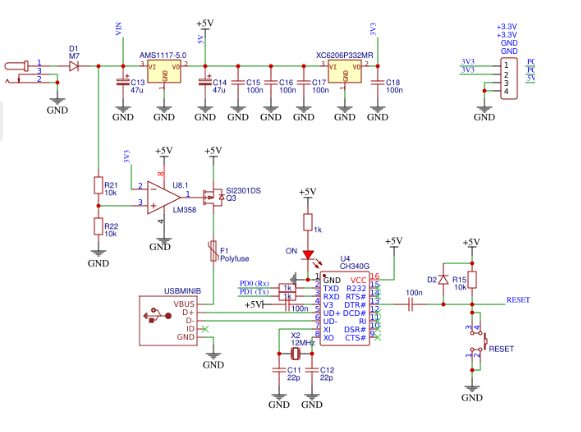

1. Use schematic of Arduino Uno and find out on which Arduino Uno pins the UART transmitter (Tx) and receiver (Rx) are located.

 

2. Remind yourself, what an ASCII table is. What codes are defined for control characters Esc, Space, Tab, and Enter?
